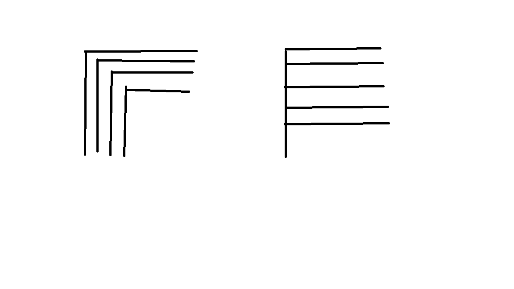
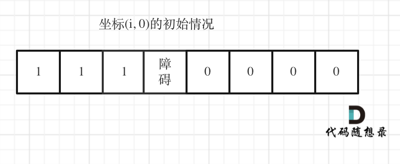

# cpp_algorithms

* 代码随想录 https://programmercarl.com/

* geeksforgeeks https://www.geeksforgeeks.org

--------------------------------------------------------------------------------
> **大家不必太在意leetcode上执行用时，打败多少多少用户，这个就是一个玩具，非常不准确。**
> 
> 做题的时候自己能分析出来时间复杂度就可以了，至于leetcode上执行用时，大概看一下就行，只要达到最优的时间复杂度就可以了，
> 
> 一样的代码多提交几次可能就击败百分之百了....
--------------------------------------------------------------------------------

# 动态规划

https://www.geeksforgeeks.org/dynamic-programming/

--------------------------------------------------------------------------------

## 不同路径 II

## _6_unique_paths_ii.md

--------------------------------------------------------------------------------

### 63. 不同路径 II

> 
> Leetcode链接: https://leetcode.cn/problems/unique-paths-ii/
>
> 一个机器人位于一个 `m x n` 网格的左上角 （起始点在下图中标记为 “`Start`” ）。
>
> 机器人每次只能向下或者向右移动一步。机器人试图达到网格的右下角（在下图中标记为 “`Finish`”）。
>
> 现在考虑网格中有障碍物。那么从左上角到右下角将会有多少条不同的路径？
>
> 网格中的障碍物和空位置分别用 `1` 和 `0` 来表示。
>
>
> **示例1：**
> > 
> > <div align=center>
> > 
> > </div>
> >  
> ```html
> 输入：obstacleGrid = [[0,0,0],[0,1,0],[0,0,0]]
> 输出：2
> 解释：3x3 网格的正中间有一个障碍物。
> 从左上角到右下角一共有 2 条不同的路径：
> 1. 向右 -> 向右 -> 向下 -> 向下
> 2. 向下 -> 向下 -> 向右 -> 向右
> ```
>
> **示例2：**
> > 
> > <div align=center>
> > 
> > </div>
> >  
> ```html
> 输入：obstacleGrid = [[0,1],[0,0]]
> 输出：1
> ```
>
>
> **提示：**
> * `m == obstacleGrid.length`
> * `n == obstacleGrid[i].length`
> * `1 <= m, n <= 100`
> * `obstacleGrid[i][j]` 为 `0` 或 `1`
>
>
> ```c++
> class Solution {
> public:
>     int uniquePathsWithObstacles(vector<vector<int>>& obstacleGrid) {
> 
>     }
> };
> ```
> 


#### 我的思路及代码

>
> 只需要`_5_unique_paths.md`的基础上加一个判断：是否遇到了障碍物, 如果`(i,j)`是障碍物，则`dp[i][j] = 0;`
>
> 
```c++
class Solution {
public:
    int uniquePathsWithObstacles(vector<vector<int>>& obstacleGrid) {
        if(obstacleGrid.size() == 0) return 0;
        if(obstacleGrid[0].size() == 0) return 0;

        int m = obstacleGrid.size();
        int n = obstacleGrid[0].size();

        // 先不考虑障碍物，怎么遍历所有的路径？

        // dp[i][j]指的是从左上角到网格点（i, j）的路径有多少种类
        // 递推关系？dp[i][j] = dp[i-1, j] + dp[i][j-1]
        // 初始化：将第0排和第0列的所有dp = 1, 只有一条路径可到达
        // 遍历方式：从(i,i)开始的第i排和第i列，i = 1, 2, 3, ..., min(m,n)

        // 然后加一个判断：是否遇到了障碍物, 如果(i,j)是障碍物，则dp[i][j] = 0;
        
        // 构建dp数组
        vector<vector<int>> dp(m, vector<int>(n, 0)); // 二维数组, 全置0
        
        // 初始化
        for(int i=0; i < m; i++) {
            if(obstacleGrid[i][0] == 1) break; // 只要这一排有一个障碍物，后面的网格都无法到达，dp[][]保持为0
            dp[i][0] = 1;
        }        
        for(int j=0; j < n; j++) {
            if(obstacleGrid[0][j] == 1) break; // 只要这一列有一个障碍物，后面的网格都无法到达，dp[][]保持为0            
            dp[0][j] = 1;
        }
        
        // 遍历过程
        for(int k=1; k < min(m,n); k++) {
            for(int i=k; i < m; i++) {
                if(obstacleGrid[i][k] == 1) { // 当前网格点是障碍物
                    dp[i][k] == 0;  // dp[][]保持为0
                }
                else {
                    dp[i][k] = dp[i-1][k] + dp[i][k-1];
                }
            }
            for(int j=k; j < n; j++) {
                if(obstacleGrid[k][j] == 1) { // 当前网格点是障碍物
                    dp[k][j] == 0;  // dp[][]保持为0
                }
                else {                
                    dp[k][j] = dp[k-1][j] + dp[k][j-1];
                }    
            }            
        }

        // 返回值
        return dp[m-1][n-1];
    }
};
```


>
> 遍历过程改为，一层层遍历
> 
> 不用执着于左侧这种方式，我们只要初始化时将最左侧一列完成，就可以一层层地，从`dp[][1] ~ dp[][n-1]`遍历了
> > 
> > <div align=center>
> > 
> > </div>
> > 
> 

```c++
class Solution {
public:
    int uniquePathsWithObstacles(vector<vector<int>>& obstacleGrid) {
        if(obstacleGrid.size() == 0) return 0;
        if(obstacleGrid[0].size() == 0) return 0;

        int m = obstacleGrid.size();
        int n = obstacleGrid[0].size();

        // 先不考虑障碍物，怎么遍历所有的路径？

        // dp[i][j]指的是从左上角到网格点（i, j）的路径有多少种类
        // 递推关系？dp[i][j] = dp[i-1, j] + dp[i][j-1]
        // 初始化：将第0排和第0列的所有dp = 1, 只有一条路径可到达
        // 遍历方式：一层层地，从dp[][1] ~ dp[][n-1]遍历

        // 然后加一个判断：是否遇到了障碍物, 如果(i,j)是障碍物，则dp[i][j] = 0;
        
        // 构建dp数组
        vector<vector<int>> dp(m, vector<int>(n, 0)); // 二维数组, 全置0
        
        // 初始化
        for(int i=0; i < m; i++) {
            if(obstacleGrid[i][0] == 1) break; // 只要这一排有一个障碍物，后面的网格都无法到达，dp[][]保持为0
            dp[i][0] = 1;
        }        
        for(int j=0; j < n; j++) {
            if(obstacleGrid[0][j] == 1) break; // 只要这一列有一个障碍物，后面的网格都无法到达，dp[][]保持为0            
            dp[0][j] = 1;
        }
        
        // 遍历过程
        for (int i = 1; i < m; i++) {
            for (int j = 1; j < n; j++) {
                if(obstacleGrid[i][j] == 1) { // 当前网格点是障碍物
                    dp[i][j] == 0;  // dp[][]保持为0
                }
                else {
                    dp[i][j] = dp[i-1][j] + dp[i][j-1];
                }                
            }
        }


        // 返回值
        return dp[m-1][n-1];
    }
};
```


#### 代码随想录

##### 思路

> 
> 这道题相对于62.不同路径 (`_5_unique_paths.md`)就是有了障碍。
>
> 第一次接触这种题目的同学可能会有点懵，这有障碍了，应该怎么算呢？
>
> 62.不同路径 (`_5_unique_paths.md`)中我们已经详细分析了没有障碍的情况，有障碍的话，其实就是标记对应的`dp table`（`dp`数组）保持初始值(`0`)就可以了。
>
> 动规五部曲：
>
> 1. 确定`dp`数组（`dp table`）以及下标的含义
>
> `dp[i][j]` ：表示从`（0 ，0）`出发，到`(i, j)` 有`dp[i][j]`条不同的路径。
>
> 2. 确定递推公式
>
> 递推公式和62.不同路径一样，`dp[i][j] = dp[i - 1][j] + dp[i][j - 1]`。
>
> 但这里需要注意一点，因为有了障碍，`(i, j)`如果就是障碍的话应该就保持初始状态（初始状态为`0`）。
>
> 所以代码为：
>
> ```c++
> if (obstacleGrid[i][j] == 0) { // 当(i, j)没有障碍的时候，再推导dp[i][j]
>     dp[i][j] = dp[i - 1][j] + dp[i][j - 1];
> }
> ```
> 
> 3. `dp`数组如何初始化
>
> 在62.不同路径(`_5_unique_paths.md`)不同路径中我们给出如下的初始化：
>
> ```c++
> vector<vector<int>> dp(m, vector<int>(n, 0)); // 初始值为0
> for (int i = 0; i < m; i++) dp[i][0] = 1;
> for (int j = 0; j < n; j++) dp[0][j] = 1;
> ```
> 
> 因为从`(0, 0)`的位置到`(i, 0)`的路径只有一条，所以`dp[i][0]`一定为`1`，`dp[0][j]`也同理。
>
> 但如果`(i, 0)` 这条边有了障碍之后，障碍之后（包括障碍）都是走不到的位置了，所以障碍之后的`dp[i][0]`应该还是初始值`0`。
>
> 如图：
> > 
> > <div align=center>
> > 
> > </div>
> >  
>
> 下标`(0, j)`的初始化情况同理。
>
> 所以本题初始化代码为：
>
> ```c++
> vector<vector<int>> dp(m, vector<int>(n, 0));
> for (int i = 0; i < m && obstacleGrid[i][0] == 0; i++) dp[i][0] = 1;
> for (int j = 0; j < n && obstacleGrid[0][j] == 0; j++) dp[0][j] = 1;
> ```
> 
> **注意代码里`for`循环的终止条件，一旦遇到`obstacleGrid[i][0] == 1`的情况就停止`dp[i][0]`的赋值`1`的操作，`dp[0][j]`同理**
>
> 
> 4. 确定遍历顺序
>
> 从递归公式`dp[i][j] = dp[i - 1][j] + dp[i][j - 1]` 中可以看出，一定是从左到右一层一层遍历，这样保证推导`dp[i][j]`的时候，`dp[i - 1][j] 和 dp[i][j - 1]`一定是有数值。
>
> 代码如下：
>
> ```c++
> for (int i = 1; i < m; i++) {
>     for (int j = 1; j < n; j++) {
>         if (obstacleGrid[i][j] == 1) continue;
>         dp[i][j] = dp[i - 1][j] + dp[i][j - 1];
>     }
> }
> ```
>
> 
> 5. 举例推导`dp`数组
>
> 拿示例1来举例如题：
> > 
> > <div align=center>
> > 
> > </div>
> >  
>
> 对应的`dp table` 如图：
> > 
> > <div align=center>
> > 
> > </div>
> >  
>
> 如果这个图看不懂，建议再理解一下递归公式，然后照着文章中说的遍历顺序，自己推导一下！
>
> 动规五部分分析完毕，对应C++代码如下：
>
> ```c++
> class Solution {
> public:
>     int uniquePathsWithObstacles(vector<vector<int>>& obstacleGrid) {
>         int m = obstacleGrid.size();
>         int n = obstacleGrid[0].size();
> 	if (obstacleGrid[m - 1][n - 1] == 1 || obstacleGrid[0][0] == 1) //如果在起点或终点出现了障碍，直接返回0
>             return 0;
>         vector<vector<int>> dp(m, vector<int>(n, 0));
>         for (int i = 0; i < m && obstacleGrid[i][0] == 0; i++) dp[i][0] = 1;
>         for (int j = 0; j < n && obstacleGrid[0][j] == 0; j++) dp[0][j] = 1;
>         for (int i = 1; i < m; i++) {
>             for (int j = 1; j < n; j++) {
>                 if (obstacleGrid[i][j] == 1) continue;
>                 dp[i][j] = dp[i - 1][j] + dp[i][j - 1];
>             }
>         }
>         return dp[m - 1][n - 1];
>     }
> };
> ```
> 
> * 时间复杂度：`O(n × m)`，n`、m` 分别为`obstacleGrid` 长度和宽度
> * 空间复杂度：`O(n × m)`
> 
> 同样我们给出空间优化版本：
>
> ```c++
> class Solution {
> public:
>     int uniquePathsWithObstacles(vector<vector<int>>& obstacleGrid) {
>         if (obstacleGrid[0][0] == 1)
>             return 0;
>         vector<int> dp(obstacleGrid[0].size());
>         for (int j = 0; j < dp.size(); ++j)
>             if (obstacleGrid[0][j] == 1)
>                 dp[j] = 0;
>             else if (j == 0)
>                 dp[j] = 1;
>             else
>                 dp[j] = dp[j-1];
> 
>         for (int i = 1; i < obstacleGrid.size(); ++i)
>             for (int j = 0; j < dp.size(); ++j){
>                 if (obstacleGrid[i][j] == 1)
>                     dp[j] = 0;
>                 else if (j != 0)
>                     dp[j] = dp[j] + dp[j-1];
>             }
>         return dp.back();
>     }
> };
> ```
> 
> * 时间复杂度：`O(n × m)`，`n、m` 分别为`obstacleGrid` 长度和宽度
> * 空间复杂度：`O(m)`
> 
> 


##### 总结

> 
> 本题是62.不同路径 (`_5_unique_paths.md`)的障碍版，整体思路大体一致。
>
> 但就算是做过62.不同路径，在做本题也会有感觉遇到障碍无从下手。
>
> 其实只要考虑到，遇到障碍`dp[i][j]`保持`0`就可以了。
>
> 也有一些小细节，例如：初始化的部分，很容易忽略了障碍之后应该都是0的情况。
>


