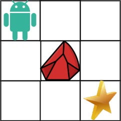

# cpp_algorithms

* 代码随想录 https://programmercarl.com/

* geeksforgeeks https://www.geeksforgeeks.org

--------------------------------------------------------------------------------
> **大家不必太在意leetcode上执行用时，打败多少多少用户，这个就是一个玩具，非常不准确。**
> 
> 做题的时候自己能分析出来时间复杂度就可以了，至于leetcode上执行用时，大概看一下就行，只要达到最优的时间复杂度就可以了，
> 
> 一样的代码多提交几次可能就击败百分之百了....
--------------------------------------------------------------------------------

# 动态规划

https://www.geeksforgeeks.org/dynamic-programming/

--------------------------------------------------------------------------------

## 不同路径 II

## _6_unique_paths_ii.md

--------------------------------------------------------------------------------

### 63. 不同路径 II

> 
> Leetcode链接: https://leetcode.cn/problems/unique-paths-ii/
>
> 一个机器人位于一个 `m x n` 网格的左上角 （起始点在下图中标记为 “`Start`” ）。
>
> 机器人每次只能向下或者向右移动一步。机器人试图达到网格的右下角（在下图中标记为 “`Finish`”）。
>
> 现在考虑网格中有障碍物。那么从左上角到右下角将会有多少条不同的路径？
>
> 网格中的障碍物和空位置分别用 `1` 和 `0` 来表示。
>
>
> **示例1：**
> > 
> > <div align=center>
> > 
> > </div>
> >  
> ```html
> 输入：obstacleGrid = [[0,0,0],[0,1,0],[0,0,0]]
> 输出：2
> 解释：3x3 网格的正中间有一个障碍物。
> 从左上角到右下角一共有 2 条不同的路径：
> 1. 向右 -> 向右 -> 向下 -> 向下
> 2. 向下 -> 向下 -> 向右 -> 向右
> ```
>
> **示例2：**
> > 
> > <div align=center>
> > 
> > </div>
> >  
> ```html
> 输入：obstacleGrid = [[0,1],[0,0]]
> 输出：1
> ```
>
>
> **提示：**
> * `m == obstacleGrid.length`
> * `n == obstacleGrid[i].length`
> * `1 <= m, n <= 100`
> * `obstacleGrid[i][j]` 为 `0` 或 `1`
>
>
> ```c++
> class Solution {
> public:
>     int uniquePathsWithObstacles(vector<vector<int>>& obstacleGrid) {
> 
>     }
> };
> ```
> 


#### 我的思路及代码


