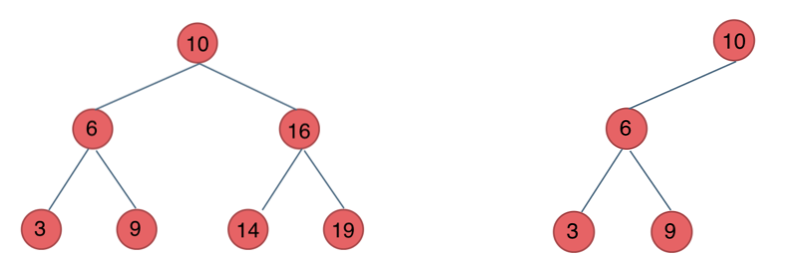
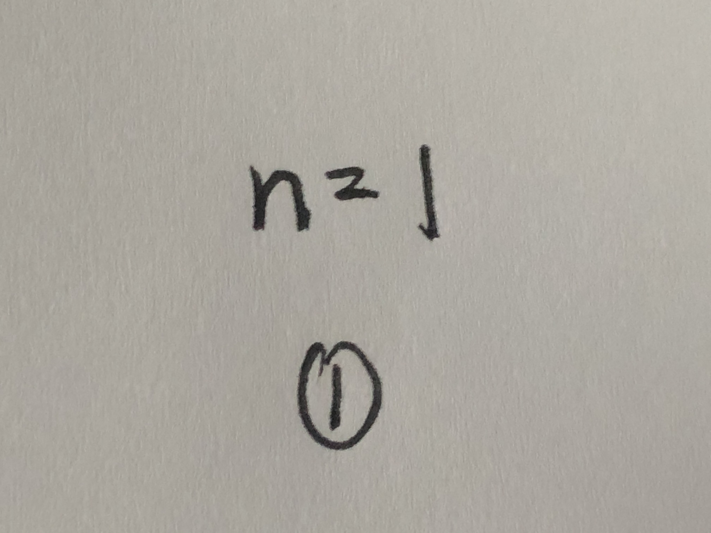
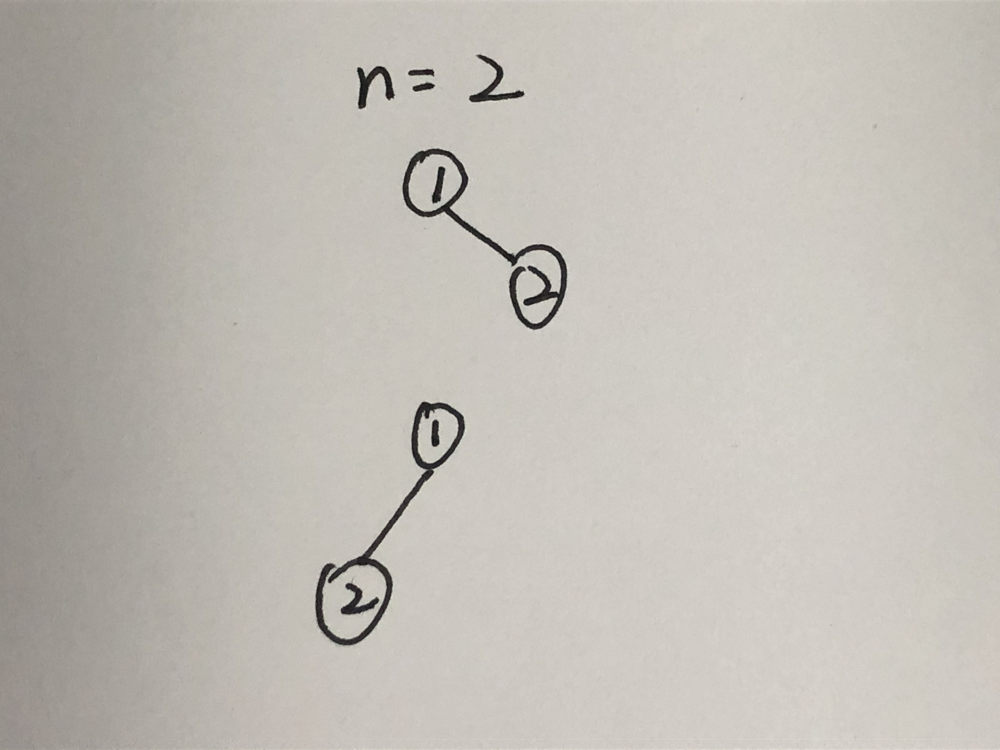
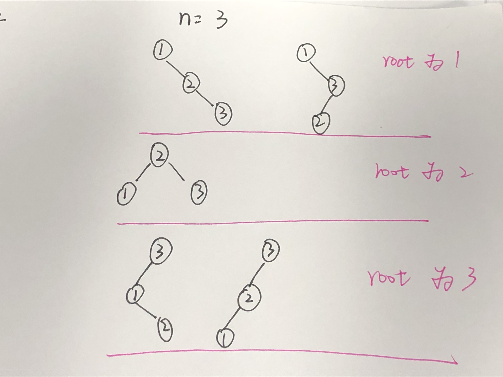
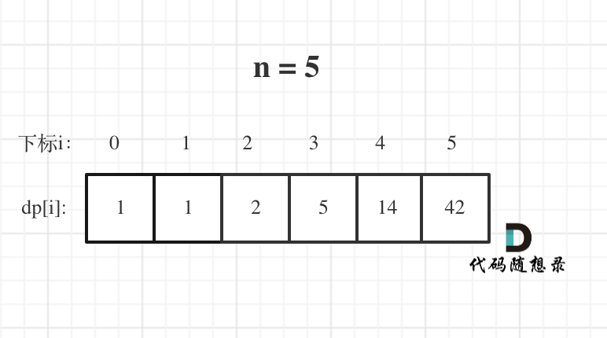

# cpp_algorithms

* 代码随想录 https://programmercarl.com/

* geeksforgeeks https://www.geeksforgeeks.org

--------------------------------------------------------------------------------
> **大家不必太在意leetcode上执行用时，打败多少多少用户，这个就是一个玩具，非常不准确。**
> 
> 做题的时候自己能分析出来时间复杂度就可以了，至于leetcode上执行用时，大概看一下就行，只要达到最优的时间复杂度就可以了，
> 
> 一样的代码多提交几次可能就击败百分之百了....
--------------------------------------------------------------------------------

# 动态规划

https://www.geeksforgeeks.org/dynamic-programming/

--------------------------------------------------------------------------------

## 不同的二叉搜索树

## _8_unique_binary_search_trees.md

--------------------------------------------------------------------------------

### 96. 不同的二叉搜索树

> 
> Leetcode链接: https://leetcode.cn/problems/unique-binary-search-trees/
>
> 给你一个整数 `n` ，求恰由 `n` 个节点组成且节点值从 `1` 到 `n` 互不相同的 **二叉搜索树** 有多少种？返回满足题意的二叉搜索树的种数。
>
> 
>
> **示例1：**
> 
> > 
> > <div align=center>
> > 
> > </div>
> >  
> ```html
> 输入：n = 3
> 输出：5
> ```
>
> 
> **示例2：**
> 
> ```html
> 输入：n = 1
> 输出：1
> ```
>
> **提示：**
> * `1 <= n <= 19`
>
> ```c++
> class Solution {
> public:
>     int numTrees(int n) {
> 
>     }
> };
> ```
> 
> 


#### 我的解法

##### 什么是二叉搜索树？

>
> 
> 二叉搜索树 ——又称二叉查找树、二叉排序树（Binary Sort Tree）
> 
> 二叉搜索树是一个有序树。
> 
> > 它是**一颗空树或是满足下列性质**的二叉树：
> > 
> > 1）若左子树不空，则左子树上所有节点的值均小于或等于它的根节点的值；
> > 
> > 2）若右子树不空，则右子树上所有节点的值均大于或等于它的根节点的值；
> > 
> > 3）左、右子树也分别为二叉排序树。 
> > 
> > 即 **左边<=根<=右边**
> > 
> > 下面这两棵树都是搜索树
> > 
> > 
> > <div align=center>
> >  
> > </div>
> 
> 
> 

##### 思考过程

>
> 出现`n`，就要考虑能否使用动规递推
>
> `dp[i] : 二叉搜索树有i个节点，节点值互不相同，从`1,2,3,...,i`都有，可以构造出`dp[i]`种二叉搜索树`
> 
> 二叉搜索树有`n`个节点，节点值互不相同，从`1,2,3,...,n`都有
>
> 又因为满足`左子树上所有的节点值 < 当前节点的值 < 右子树上所有的节点值`
>
> 我们需要寻找递推关系：n`个节点的二叉搜索树，与`k (k = n-1、n-2、n-3、...、3、2、1)`个节点的二叉搜索树，之间有什么联系
>
> <font color="gree">画出具体的几颗树，看能不能找到思路</font>
> > 
> > <div align=center>
> >  
> >  
> >  
> >   
> > </div>
> 
>
> ```c++
> n = 1时， dp[1] = 1
> n = 2时， dp[2] = 2
> n = 3时， dp[3] = 5
> n = 4时， dp[4] = 14
> ```
> 
> <font color="yellow">我们手画时，是如何遍历的呢？</font>
> 
> <font color="gree">对于`n=3`来说，分情况讨论</font>
>
> > * 当根节点为`1`时，剩下的两个节点值可选`{2,3}`，都比`1`大，所以只能放在右子树，这时候问题转化为`2`个节点的二叉搜索树有多少种？`dp[2]`就是该情况的种类数. 因为`{2,3}`组成二叉搜索树，`{1,2}`组成二叉搜索树，本质上是一样的
> > 
> > * 当根节点为`2`时，剩下的两个节点值可选`{1,3}`，`{1}`只能放在左子树，`{3}`只能放在右子树，那么问题转化为`1`个节点的二叉搜索树有多少种？`dp[1]*dp[1]`就是该情况的种类数
> > 
> > * 当根节点为`3`时，剩下的两个节点值可选`{1,2}`，都比`3`小，所以只能放在左子树，这时候问题转化为`2`个节点的二叉搜索树有多少种？`dp[2]`就是该情况的种类数. 因为`{1,2}`组成二叉搜索树，就是`dp[2]`
> > 
> > `3`种情况加起来，`dp[3] = dp[2] + dp[1]*dp[1] + dp[2] = 2 + 1*1+ 2 = 5`
> > 
> 
> 
> <font color="gree">对于n=4来说，分情况讨论</font>
>
> > * 当根节点为`1`时，剩下的两个节点值可选`{2,3,4}`，都比`1`大，所以只能放在右子树，这时候问题转化为`3`个节点的二叉搜索树有多少种？`dp[3]`就是该情况的种类数. 因为`{2,3,4}`组成二叉搜索树，`{1,2,3}`组成二叉搜索树，本质上是一样的 '
> > 
> > * 当根节点为`2`时，剩下的两个节点值可选`{1,3,4}`，`{1}`只能放在左子树，`{3,4}`只能放在右子树，那么问题转化为`1,2`个节点的二叉搜索树有多少种？`dp[1]*dp[2]`就是该情况的种类数
> > 
> > * 当根节点为`3`时，剩下的两个节点值可选`{1,2,4}`，`{1,2}`只能放在左子树，`{4}`只能放在右子树，那么问题转化为`2,1`个节点的二叉搜索树有多少种？`dp[2]*dp[1]`就是该情况的种类数
> > 
> > * 当根节点为`4`时，剩下的两个节点值可选`{1,2,3}`，都比`4`小，所以只能放在左子树，这时候问题转化为`3`个节点的二叉搜索树有多少种？`dp[3]`就是该情况的种类数. 因为`{1,2,3}`组成二叉搜索树，恰恰就是`dp[3]`
> > 
> > `4`种情况加起来，`dp[4] = dp[3] + dp[1]*dp[2] + dp[2]*dp[1] + dp[3] = 5 + 1*2 + 2*1 + 5 = 14`
> > 
>
> <font color="gree">那么，从具体到抽象，`dp[n]`怎么计算呢？</font>
>
> > * 当根节点为`1`时，剩下的`n-1`个节点值可选`{2,3,...,n}`，都比`1`大，所以只能放在右子树，这时候问题转化为`n-1`个节点的二叉搜索树有多少种？`dp[n-1]`就是该情况的种类数. 因为`{2,3,...,n}`组成二叉搜索树，`{1,2,...,n-1}`组成二叉搜索树，本质上是一样的
> > 
> > * 当根节点为`2`时，剩下的`n-1`个节点值可选`{1,3,4,...,n}`，`{1}`只能放在左子树，`{3,4,...,n}`只能放在右子树，那么问题转化为`1,n-2`个节点的二叉搜索树有多少种？`dp[1]*dp[n-2]`就是该情况的种类数
> > 
> > * ...
> > 
> > * 当根节点为`k`时，剩下的`n-1`个节点值可选`{1,2,3,...,k-1, k+1,k+2,...,n}`，`{1,2,3,...,k-1}`只能放在左子树，`{k+1,k+2,...,n}`只能放在右子树，那么问题转化为`k-1,n-k`个节点的二叉搜索树有多少种？`dp[k-1]*dp[n-k]`就是该情况的种类数
> >
> > * ...
> >
> > * 当根节点为`n`时，剩下的`n-1`个节点值可选`{1,2,3,...,n-1}`，都比`n`小，所以只能放在左子树，这时候问题转化为`n-1`个节点的二叉搜索树有多少种？`dp[n-1]`就是该情况的种类数. 因为`{1,2,3,...,n-1}`组成二叉搜索树，恰恰就是`dp[n-1]`
> >
> > 我们设`dp[0] = 1`;
> > 
> > `n`种情况加起来，`dp[n] = dp[0]*dp[n-1]  + dp[1]*dp[n-2] + ... + dp[n-2]*dp[1] + dp[n-1] * dp[0]`
> >
> > 即 `dp[n] = sigma {dp[k-1] * dp[n-k]} k =1,2,3...,n`  将这`n`种情况相加
> >
> > 
> 

```c++
class Solution {
public:
    int numTrees(int n) {
        // 出现n，就要考虑能否使用动规递推
        
        // 二叉搜索树有n个节点，节点值互不相同，从1,2,3,...,n都有
        // 又因为满足左子树上所有的节点值 < 当前节点的值 < 右子树上所有的节点值

        // 我们需要寻找递推关系：n个节点的二叉搜索树，与k (k = n-1、n-2、n-3、...、3、2、1)个节点的二叉搜索树，之间有什么联系
        // 画出具体的树
        // n = 1时， dp[1] = 1
        // n = 2时， dp[2] = 2
        // n = 3时， dp[3] = 5           
        // n = 4时， dp[4] = 14
        
        // 我们手画时，是如何遍历的呢？
        // 对于n=3来说，分情况讨论
        // 当根节点为1时，剩下的两个节点值可选{2,3}，都比1大，所以只能放在右子树，这时候问题转化为2个节点的二叉搜索树有多少种？dp[2]就是该情况的种类数. 因为{2,3}组成二叉搜索树，{1,2}组成二叉搜索树，本质上是一样的
        // 当根节点为2时，剩下的两个节点值可选{1,3}，{1}只能放在左子树，{3}只能放在右子树，那么问题转化为1个节点的二叉搜索树有多少种？dp[1]*dp[1]就是该情况的种类数
        // 当根节点为3时，剩下的两个节点值可选{1,2}，都比3小，所以只能放在左子树，这时候问题转化为2个节点的二叉搜索树有多少种？dp[2]就是该情况的种类数. 因为{1,2}组成二叉搜索树，就是dp[2]
        // 3种情况加起来，dp[3] = dp[2] + dp[1]*dp[1] + dp[2] = 2 + 1*1+ 2 = 5

        // 对于n=4来说，分情况讨论
        // 当根节点为1时，剩下的两个节点值可选{2,3,4}，都比1大，所以只能放在右子树，这时候问题转化为3个节点的二叉搜索树有多少种？dp[3]就是该情况的种类数. 因为{2,3,4}组成二叉搜索树，{1,2,3}组成二叉搜索树，本质上是一样的
        // 当根节点为2时，剩下的两个节点值可选{1,3,4}，{1}只能放在左子树，{3,4}只能放在右子树，那么问题转化为1,2个节点的二叉搜索树有多少种？dp[1]*dp[2]就是该情况的种类数
        // 当根节点为3时，剩下的两个节点值可选{1,2,4}，{1,2}只能放在左子树，{4}只能放在右子树，那么问题转化为2,1个节点的二叉搜索树有多少种？dp[2]*dp[1]就是该情况的种类数
        // 当根节点为4时，剩下的两个节点值可选{1,2,3}，都比4小，所以只能放在左子树，这时候问题转化为3个节点的二叉搜索树有多少种？dp[3]就是该情况的种类数. 因为{1,2,3}组成二叉搜索树，恰恰就是dp[3]
        // 4种情况加起来，dp[4] = dp[3] + dp[1]*dp[2] + dp[2]*dp[1] + dp[3] = 5 + 1*2 + 2*1 + 5 = 14


        // 那么，从具体到抽象，dp[n]怎么计算呢？
        // 当根节点为1时，剩下的n-1个节点值可选{2,3,...,n}，都比1大，所以只能放在右子树，这时候问题转化为n-1个节点的二叉搜索树有多少种？dp[n-1]就是该情况的种类数. 因为{2,3,...,n}组成二叉搜索树，{1,2,...,n-1}组成二叉搜索树，本质上是一样的
        // 当根节点为2时，剩下的n-1个节点值可选{1,3,4,...,n}，{1}只能放在左子树，{3,4,...,n}只能放在右子树，那么问题转化为1,n-2个节点的二叉搜索树有多少种？dp[1]*dp[n-2]就是该情况的种类数
        // ...
        // 当根节点为k时，剩下的n-1个节点值可选{1,2,3,...,k-1, k+1,k+2,...,n}，{1,2,3,...,k-1}只能放在左子树，{k+1,k+2,...,n}只能放在右子树，那么问题转化为k-1,n-k个节点的二叉搜索树有多少种？dp[k-1]*dp[n-k]就是该情况的种类数
        // ...
        // 当根节点为n时，剩下的n-1个节点值可选{1,2,3,...,n-1}，都比n小，所以只能放在左子树，这时候问题转化为n-1个节点的二叉搜索树有多少种？dp[n-1]就是该情况的种类数. 因为{1,2,3,...,n-1}组成二叉搜索树，恰恰就是dp[n-1]


        // 我们设dp[0] = 1;
        // n种情况加起来，dp[n] = dp[0]*dp[n-1]  + dp[1]*dp[n-2] + ... + dp[n-2]*dp[1] + dp[n-1] * dp[0]
        // 即 dp[n] = sigma {dp[k-1] * dp[n-k]} k =1,2,3...,n   将这n种情况相加
        
    }
};
```


##### 代码

```c++
class Solution {
public:
    int numTrees(int n) {
        // 出现n，就要考虑能否使用动规递推
        
        // 二叉搜索树有n个节点，节点值互不相同，从1,2,3,...,n都有
        // 又因为满足左子树上所有的节点值 < 当前节点的值 < 右子树上所有的节点值

        // 我们需要寻找递推关系：n个节点的二叉搜索树，与k (k = n-1、n-2、n-3、...、3、2、1)个节点的二叉搜索树，之间有什么联系
        // 画出具体的树
        // n = 1时， dp[1] = 1
        // n = 2时， dp[2] = 2
        // n = 3时， dp[3] = 5           
        // n = 4时， dp[4] = 14
        
        // 我们手画时，是如何遍历的呢？
        // 对于n=3来说，分情况讨论
        // 当根节点为1时，剩下的两个节点值可选{2,3}，都比1大，所以只能放在右子树，这时候问题转化为2个节点的二叉搜索树有多少种？dp[2]就是该情况的种类数. 因为{2,3}组成二叉搜索树，{1,2}组成二叉搜索树，本质上是一样的
        // 当根节点为2时，剩下的两个节点值可选{1,3}，{1}只能放在左子树，{3}只能放在右子树，那么问题转化为1个节点的二叉搜索树有多少种？dp[1]*dp[1]就是该情况的种类数
        // 当根节点为3时，剩下的两个节点值可选{1,2}，都比3小，所以只能放在左子树，这时候问题转化为2个节点的二叉搜索树有多少种？dp[2]就是该情况的种类数. 因为{1,2}组成二叉搜索树，就是dp[2]
        // 3种情况加起来，dp[3] = dp[2] + dp[1]*dp[1] + dp[2] = 2 + 1*1+ 2 = 5

        // 对于n=4来说，分情况讨论
        // 当根节点为1时，剩下的两个节点值可选{2,3,4}，都比1大，所以只能放在右子树，这时候问题转化为3个节点的二叉搜索树有多少种？dp[3]就是该情况的种类数. 因为{2,3,4}组成二叉搜索树，{1,2,3}组成二叉搜索树，本质上是一样的
        // 当根节点为2时，剩下的两个节点值可选{1,3,4}，{1}只能放在左子树，{3,4}只能放在右子树，那么问题转化为1,2个节点的二叉搜索树有多少种？dp[1]*dp[2]就是该情况的种类数
        // 当根节点为3时，剩下的两个节点值可选{1,2,4}，{1,2}只能放在左子树，{4}只能放在右子树，那么问题转化为2,1个节点的二叉搜索树有多少种？dp[2]*dp[1]就是该情况的种类数
        // 当根节点为4时，剩下的两个节点值可选{1,2,3}，都比4小，所以只能放在左子树，这时候问题转化为3个节点的二叉搜索树有多少种？dp[3]就是该情况的种类数. 因为{1,2,3}组成二叉搜索树，恰恰就是dp[3]
        // 4种情况加起来，dp[4] = dp[3] + dp[1]*dp[2] + dp[2]*dp[1] + dp[3] = 5 + 1*2 + 2*1 + 5 = 14


        // 那么，从具体到抽象，dp[n]怎么计算呢？
        // 当根节点为1时，剩下的n-1个节点值可选{2,3,...,n}，都比1大，所以只能放在右子树，这时候问题转化为n-1个节点的二叉搜索树有多少种？dp[n-1]就是该情况的种类数. 因为{2,3,...,n}组成二叉搜索树，{1,2,...,n-1}组成二叉搜索树，本质上是一样的
        // 当根节点为2时，剩下的n-1个节点值可选{1,3,4,...,n}，{1}只能放在左子树，{3,4,...,n}只能放在右子树，那么问题转化为1,n-2个节点的二叉搜索树有多少种？dp[1]*dp[n-2]就是该情况的种类数
        // ...
        // 当根节点为k时，剩下的n-1个节点值可选{1,2,3,...,k-1, k+1,k+2,...,n}，{1,2,3,...,k-1}只能放在左子树，{k+1,k+2,...,n}只能放在右子树，那么问题转化为k-1,n-k个节点的二叉搜索树有多少种？dp[k-1]*dp[n-k]就是该情况的种类数
        // ...
        // 当根节点为n时，剩下的n-1个节点值可选{1,2,3,...,n-1}，都比n小，所以只能放在左子树，这时候问题转化为n-1个节点的二叉搜索树有多少种？dp[n-1]就是该情况的种类数. 因为{1,2,3,...,n-1}组成二叉搜索树，恰恰就是dp[n-1]


        // 我们设dp[0] = 1;
        // n种情况加起来，dp[n] = dp[0]*dp[n-1]  + dp[1]*dp[n-2] + ... + dp[n-2]*dp[1] + dp[n-1] * dp[0]
        // 即 dp[n] = sigma {dp[k-1] * dp[n-k]} k =1,2,3...,n   将这n种情况相加
        
        if(n < 3) return n;

        vector<int> dp(n+1, 0);
        dp[0] = 1; // 为了运算方便
        dp[1] = 1;
        dp[2] = 2;

        for(int i = 3; i <= n; i++) {
            dp[i] = 0;
            for(int k=1; k <= i; k++) {
                dp[i] += dp[k-1] * dp[i-k];
            }
        }

        return dp[n];
    }
};
```


#### 思路

>
> 这道题目描述很简短，但估计大部分同学看完都是懵懵的状态，这得怎么统计呢？
>
> 关于什么是二叉搜索树，我们之前在讲解二叉树专题的时候已经详细讲解过了，也可以看看这篇二叉树：二叉搜索树登场！ (`../../_2_data_structure/_2_6_Binary_Tree/Binary_Tree.md`)再回顾一波。
>
> 了解了二叉搜索树之后，我们应该先举几个例子，画画图，看看有没有什么规律，如图：
>  
> > <div align=center>
> >  
> > </div>
> 
> `n`为`1`的时候有一棵树，`n`为`2`有两棵树，这个是很直观的。
>  
> > <div align=center>
> >  
> > </div>
>
> 来看看`n`为`3`的时候，有哪几种情况。
>
> 当`1`为头结点的时候，其右子树有两个节点，看这两个节点的布局，是不是和 `n` 为`2`的时候两棵树的布局是一样的啊！
>
> （可能有同学问了，这布局不一样啊，节点数值都不一样。别忘了我们就是求不同树的数量，并不用把搜索树都列出来，所以不用关心其具体数值的差异）
>
> 当`3`为头结点的时候，其左子树有两个节点，看这两个节点的布局，是不是和n为2的时候两棵树的布局也是一样的啊！
>
> 当`2`为头结点的时候，其左右子树都只有一个节点，布局是不是和`n`为`1`的时候只有一棵树的布局也是一样的啊！
>
> 发现到这里，其实我们就找到了重叠子问题了，其实也就是发现可以通过`dp[1]` 和 `dp[2]` 来推导出来`dp[3]`的某种方式。
>
> 思考到这里，这道题目就有眉目了。
>
> dp[3]，就是 元素`1`为头结点搜索树的数量 + 元素`2`为头结点搜索树的数量 + 元素`3`为头结点搜索树的数量
> > 
> > 元素`1`为头结点搜索树的数量 = 右子树有`2`个元素的搜索树数量 * 左子树有`0`个元素的搜索树数量
> > 
> > 元素`2`为头结点搜索树的数量 = 右子树有`1`个元素的搜索树数量 * 左子树有`1`个元素的搜索树数量
> > 
> > 元素`3`为头结点搜索树的数量 = 右子树有`0`个元素的搜索树数量 * 左子树有`2`个元素的搜索树数量
> > 
> 
> > 有`2`个元素的搜索树数量就是`dp[2]`。
> >
> > 有`1`个元素的搜索树数量就是`dp[1]`。
> >
> > 有`0`个元素的搜索树数量就是`dp[0]`。
> >
>
> 所以`dp[3] = dp[2] * dp[0] + dp[1] * dp[1] + dp[0] * dp[2]`
>
> 如图所示：
>  
> > <div align=center>
> >  
> > </div>
>
> 此时我们已经找到递推关系了，那么可以用动规五部曲再系统分析一遍。
>
> 1. 确定`dp`数组（`dp table`）以及下标的含义
> 
> `dp[i] ： 1到i为节点组成的二叉搜索树的个数为dp[i]。`
>
> `也可以理解是i个不同元素节点组成的二叉搜索树的个数为dp[i] ，都是一样的。`
>
> 以下分析如果想不清楚，就来回想一下`dp[i]`的定义
>
> 2. 确定递推公式
>
> 在上面的分析中，其实已经看出其递推关系， `dp[i] += dp[以j为头结点左子树节点数量] * dp[以j为头结点右子树节点数量]`
>
> `j`相当于是头结点的元素，从`1`遍历到`i`为止。
>
> 所以递推公式：`dp[i] += dp[j - 1] * dp[i - j]`; ，`j-1` 为`j`为头结点左子树节点数量，`i-j` 为以`j`为头结点右子树节点数量
>
> 3. `dp`数组如何初始化
> 
> 初始化，只需要初始化`dp[0]`就可以了，推导的基础，都是`dp[0]`。
>
> 那么`dp[0]`应该是多少呢？
>
> 从定义上来讲，空节点也是一棵二叉树，也是一棵二叉搜索树，这是可以说得通的。
>
> 从递归公式上来讲，`dp[以j为头结点左子树节点数量] * dp[以j为头结点右子树节点数量]` 中以`j`为头结点左子树节点数量为`0`，也需要`dp[以j为头结点左子树节点数量] = 1`， 否则乘法的结果就都变成`0`了。
>
> 所以初始化`dp[0] = 1`
>
> 4. 确定遍历顺序
>
> 首先一定是遍历节点数，从递归公式：`dp[i] += dp[j - 1] * dp[i - j]`可以看出，节点数为`i`的状态是依靠 `i`之前节点数的状态。
>
> 那么遍历`i`里面每一个数作为头结点的状态，用`j`来遍历。
>
> 代码如下：
>
> ```c++
> for (int i = 1; i <= n; i++) {
>     for (int j = 1; j <= i; j++) {
>         dp[i] += dp[j - 1] * dp[i - j];
>     }
> }
> ```
> 
> 5. 举例推导`dp`数组
>
> `n`为`5`时候的`dp`数组状态如图：
>  
> > <div align=center>
> >  
> > </div>
>
> 当然如果自己画图举例的话，基本举例到`n`为`3`就可以了，`n`为`4`的时候，画图已经比较麻烦了。
>
> **我这里列到了`n`为`5`的情况，是为了方便大家 `debug`代码的时候，把`dp`数组打出来，看看哪里有问题。**
>
> 综上分析完毕，C++代码如下：
>
> ```c++
> class Solution {
> public:
>     int numTrees(int n) {
>         vector<int> dp(n + 1);
>         dp[0] = 1;
>         for (int i = 1; i <= n; i++) {
>             for (int j = 1; j <= i; j++) {
>                 dp[i] += dp[j - 1] * dp[i - j];
>             }
>         }
>         return dp[n];
>     }
> };
> ```
> 
> * 时间复杂度：$O(n^2)$
> * 空间复杂度：$O(n)$
>
> 大家应该发现了，我们分析了这么多，最后代码却如此简单！
> 


##### 总结

>
> 这道题目虽然在力扣上标记是中等难度，但可以算是困难了！
>
> 首先这道题想到用动规的方法来解决，就不太好想，需要举例，画图，分析，才能找到递推的关系。
>
> 然后难点就是确定递推公式了，如果把递推公式想清楚了，遍历顺序和初始化，就是自然而然的事情了。
>
> 可以看出我依然还是用动规五部曲来进行分析，会把题目的方方面面都覆盖到！
>
> 而且具体这五部分析是我自己平时总结的经验，找不出来第二个的，可能过一阵子 其他题解也会有动规五部曲了，哈哈。
>
> 当时我在用动规五部曲讲解斐波那契的时候，一些录友和我反应，感觉讲复杂了。
>
> 其实当时我一直强调简单题是用来练习方法论的，并不能因为简单我就代码一甩，简单解释一下就完事了。
>
> 可能当时一些同学不理解，现在大家应该感受方法论的重要性了，加油💪
>
> 


